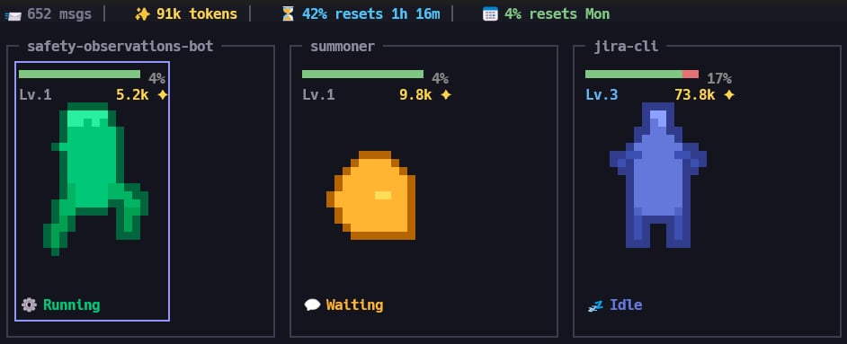

# Summoner

A gamified terminal session manager for Claude Code. Run several Claude Code sessions side by side, each represented by a procedurally-generated pixel-art creature that shows what that session is doing: working, waiting, idle or sleeping.



Sessions persist across restarts. Close Summoner, reopen it later, and your sessions are waiting to be resumed together with their Claude conversation.

## Features

- **Multi-session management** — run several Claude Code (or plain shell) sessions in parallel
- **Project grouping** — sessions are grouped by working directory
- **Dashboard** — a grid of project cards with animated creatures, level and token usage per session
- **Session persistence** — sessions survive restarts, and Claude conversations resume where they left off
- **Claude state detection** — Claude Code's hook API drives the creature's pose and colour in real time
- **In-app selection** — copy terminal output as markdown, with tables, code fences and links preserved
- **Keyboard-driven** — F-keys switch sessions, Shift+F12 opens a fuzzy session search

## Install

Requires Rust 1.85 or later (edition 2024).

```bash
cargo install --path .
```

This puts the `summoner` binary in `~/.cargo/bin/`, which should be on your PATH.

## Usage

```bash
summoner             # start the session manager
summoner install     # install the Claude Code hooks only
summoner uninstall   # remove the hooks, scripts and state files
```

Hooks are installed automatically on first run. `summoner install` is there for when you want to set them up without starting the UI.

### Global keys

| Key | Action |
|-----|--------|
| `F1`–`F11` | Switch to session by position |
| `F12` | Toggle between the dashboard and the last session |
| `Shift+F12` | Session switcher: fuzzy search across all sessions |
| `Ctrl+Q` | Quit, with confirmation (sessions are saved) |

### Dashboard

| Key | Action |
|-----|--------|
| `Arrow keys` | Move the selection |
| `Enter` | Open the selected session |
| `n` | New session in the selected project's directory |
| `N` | New session, choosing a directory |
| `r` | Reorder mode: arrows move the session, `Enter` or `Esc` leaves |
| `R` | Reroll the selected session's creature |
| `x` | Close the selected session |
| `X` | Close every session in the selected project, with confirmation |
| Mouse wheel | Scroll the card grid |

### Inside a session

Keys go straight to the program in the session. The exceptions handle selection and links.

| Input | Action |
|-------|--------|
| Drag | Select, converting the output to markdown as it is copied |
| `Alt`+drag | Select the raw characters instead, for pasting into a shell |
| Double-click | Select a word, or a whole URL |
| Triple-click | Select a logical line |
| `Ctrl+C` | Copy the selection; with no selection, it goes to the program |
| `Ctrl`+click | Open a link in your browser |

A session whose shell has exited shows a resume dialog: `r` resumes the Claude conversation, `s` starts a fresh shell, `Esc` returns to the dashboard.

## How it works

Summoner spawns each session as a PTY and renders it through a VT100 emulator, so it needs no tmux or Zellij. It learns what Claude Code is doing from hooks it installs in `~/.claude/settings.json`, which write small state files that Summoner polls to drive each creature's animation and colour.

A disconnected session is restored by spawning a shell in its original directory and running `claude --resume <conversation_id>` when a conversation was active.

Because Summoner runs nested inside your terminal, selection, copying and link clicking are handled in-app rather than by the host terminal. Smart selection reconstructs markdown from what is on screen: headings, inline code, fenced code blocks, tables and links.

## Config

Configuration lives in `~/.summoner/`:

| File | Purpose |
|------|---------|
| `config.toml` | Shell, animation speed, session prune days |
| `sessions.toml` | Persisted session state |
| `recent_dirs.toml` | Directory history for the picker |
| `hooks/` | The hook and status line scripts Summoner installs |
| `claude-states/` | Per-shell state files written by the hooks |

### Environment variables

| Variable | Description |
|----------|-------------|
| `SUMMONER_ALLOW_ALT_SCREEN` | Set to `1` to stop stripping alternate-screen escape sequences from session output. By default Summoner strips them and sets `CLAUDE_CODE_DISABLE_ALTERNATE_SCREEN=1`, so Claude Code keeps its conversation in the emulator's own scrollback. |

## Documentation

- [docs/creature-animation.md](docs/creature-animation.md) — how the creatures are built and animated
- [CLAUDE.md](CLAUDE.md) — architecture notes and module map

## Licence

MIT. See [LICENSE](LICENSE).

The `vendor/vt100` directory holds a patched copy of [vt100-rust](https://github.com/doy/vt100-rust) by Jesse Luehrs, used under its own MIT licence.

Summoner is an independent project and is not affiliated with or endorsed by Anthropic.
